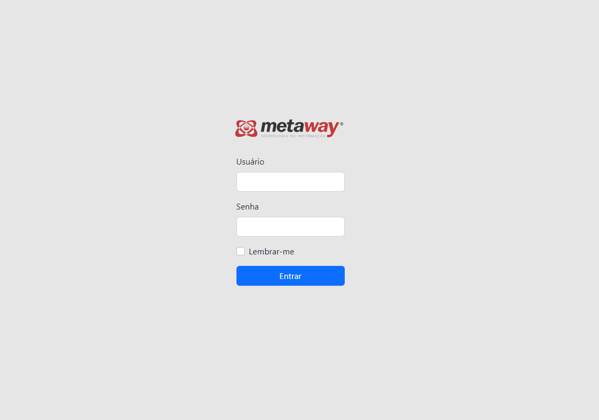

# Metaway

## Tecnologias utilizadas 
- Angular@13.2.6
- Bootstrap

## Rodar o projeto
```
git clone https://github.com/Roseffc/Agenda-Pessoal
cd AgendaPessoal
npm install 
ng serve

Abrir navegador: http://localhost:4200
```
## Demo do Sistema
- [Agenda Pessoal] (https://agenda-pessoal-ys7p.vercel.app/login)

## <p align="center"><br>Login</p>
